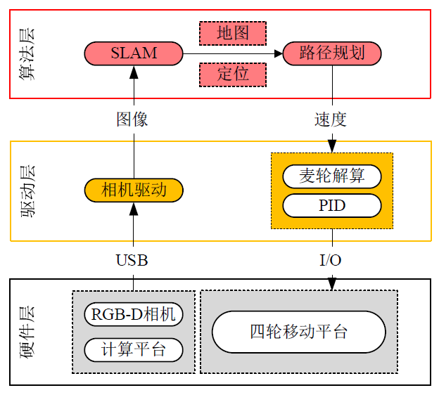
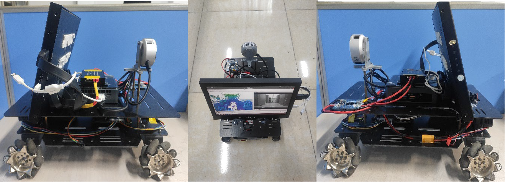
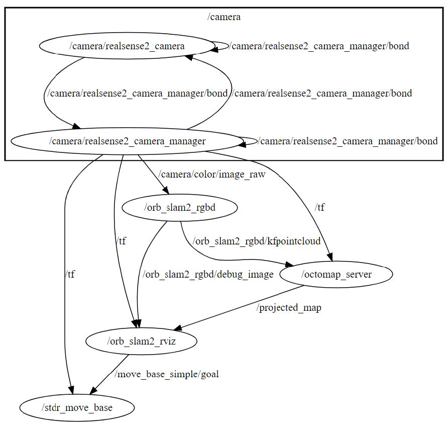
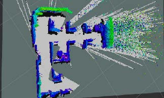
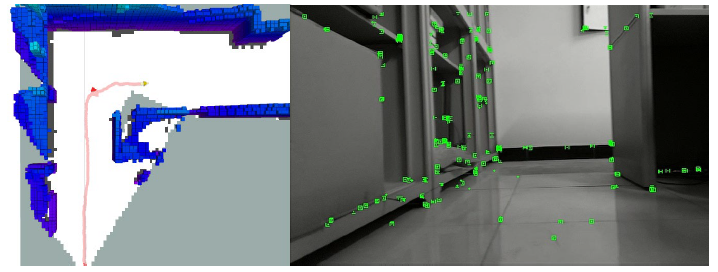
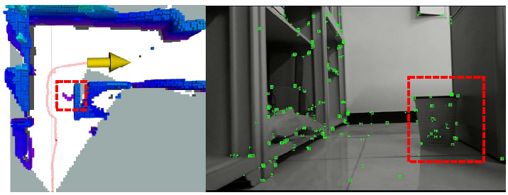
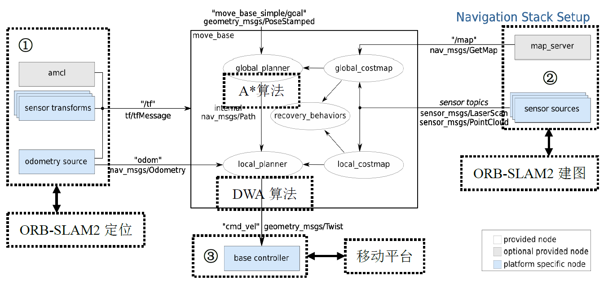

# 基于ORB-SLAM2的室内导航
## 项目简介
通过对ORB-SLAM2算法的功能进行稠密建图功能扩展，使其具备实时稠密点云
建图功能。进一步针对点云地图难以维护更新，重叠与拖影严重的问题，通过
octomap_server将点云地图转化为八叉树地图。
在ORB-SLAM2所构建的八叉树地图上，基于ROS的move_base功能包，实现了
基于A*算法的全局路径规划和采用DWA算法的局部路径规划。
## 系统架构

其中硬件部分包括：
- RGB-D相机：intel realsense L515
- 计算平台：Intel NUC8i5BEK4，其运存8G，搭载CPU为酷睿i5-8259U
- 四轮移动平台：基于麦克纳姆轮的四轮移动平台

其中软件部分包括：
- SLAM：ORB-SLAM2 RGB-D模式
- 路径规划：movebase
- 运行系统：ubuntu 18.04
- ROS版本：Melodic 
## 实物情况

## 功能包说明

### realsense-ros
intel提供的realsense系列摄像头在ROS环境下的驱动，用于驱动本项目所用到的Realsense L515摄像头

在realsense-ros/realsense2_camera/launch/rs_camera.launch文件中调整对应参数

### orb_slam_2_ros
此功能包原项目地址为 https://github.com/appliedAI-Initiative/orb_slam_2_ros.git

orb_slam2的原作者虽然提供了在ros环境下运行的案例，但是较为简略，没有提供必要的话题和消息接口，此功能包为orb-slam2在ROS下的运行提供了完整的参数、话题、消息、服务接口，其所提供的消息接口可在ros-wiki中查看，链接如下  http://wiki.ros.org/orb_slam2_ros

在orb_slam_2_ros/ros/launch/orb_slam2_l515_rgbd.launch文件中调整参数，

注：此launch文件将启动其他必要的功能包，而不需要挨个启动。

### octomap_server
用于管理orb_slam_2_ros所提供的点云图，根据其提供的tf关系，实时构建八叉树地图，并通过投影的方式构建栅格地图，所构建的栅格地图用于导航

### stdr_simulator
包括stdr_amcl、stdr_gmapping、stdr_move_base、stdr_simulator这四个功能包，是一个轻量级的用于显示导航信息的GUI

### 功能包关系图

## 实现效果

## 实现原理
move_base的基本结构如下所示

在本项目中，ORB-SLAM2将代替上图中sensor和map_server为系统提供地图信息、里程计信息和位姿变换信息，而中间白框的全局路径规划器和局部路径规划器所使用的路径规划算法可以在move_base功能包中进行配置。本项目中全局路径规划算法选择A*算法，局部路径规划算法选择DWA算法。具体如下所示

而自动导航功能即只使用局部地图进行路径规划，每次到达目标点后就自动选择局部地图上未经过的地图点，完成自动导航建图功能。
## 关于ORB-SLAM2
想要复现原作者的ORB-SLAM2源码，可参考本人的博客 https://blog.csdn.net/weixin_41655430/article/details/115171181?spm=1001.2014.3001.5501

原版的ORB_SLAM2中并没有提供多余的接口，而且其中涉及到的依赖项的问题特别多，建议大家直接用本项目所使用的功能包，无需在意依赖库版本的问题，可以节约很多不必要的时间